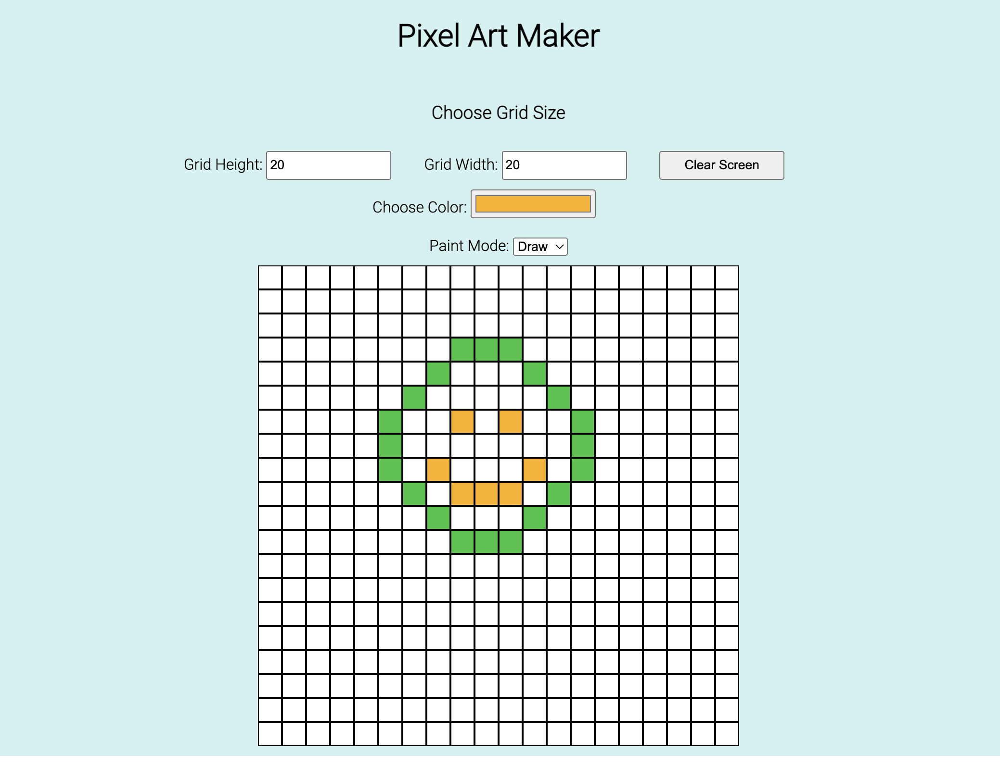

# PIXEL ART MAKER

Pixel Art Maker is a JavaScript Application that can be used to design artwork. Currently implemented features include canvas size resizer, color picker, paint mode, and a canvas grid.

Instructions:
1. To draw, make sure the Paint Mode is set to Draw. Then, click on the canvas to draw pixels.
2. To erase a pixel color, set the paint mode to Erase. Then, click on the pixel that you want to reset.
3. To choose a paint color, click on the color picker and pick your desired color from color pallete.
4. To change the grid size, change the values of gridHeight and gridWidth.
5. To clear the screen, click on clear screen. The screen will be set to the default color.

Below is a snapshot of the application:

